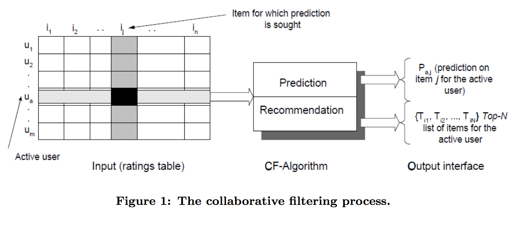
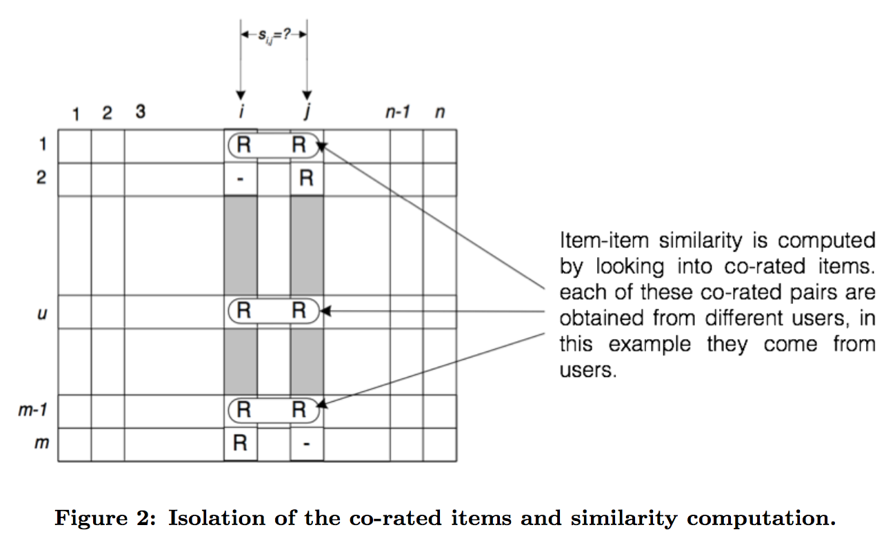
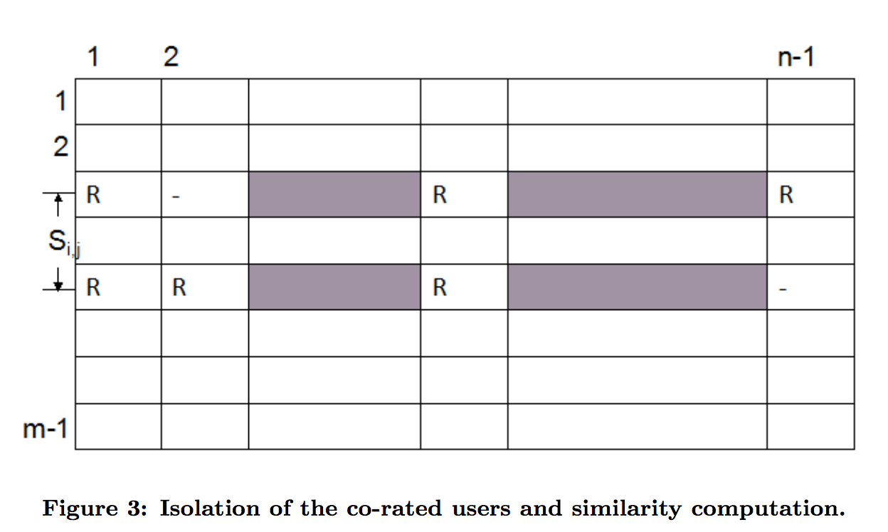

<style type="text/css">
body {
text-align: justify;
font-size: 12pt;
max-width: 1200px;
margin-left: 100px;
margin-right: 100px;
}
body .main-container {
max-width: 1200px;
font-size: 12pt;
}
</style>
## Introduction
* Recommender systems have become an important research area since the appearance of the first papers on collaborative filtering in the mid-1990s. There has been much work done over the past decade in both industry and academia on developing new approaches to improve recommender systems. The interest in this problem-rich research area remains high because of the abundance of practical applications that help users deal with information overload by providing personalized recommendations, content, and services to them.



* In this project, we build and evaluate memory-based and model-based recommender systems for jokes. We will be using the `recommenderlab` package in R. Additionally, we will demonstrate a brute force coding approach to item-based collaborative filtering.

```{r echo=TRUE, message=FALSE, warning=FALSE}
library(knitr)
read_chunk('packages_libraries.R')
read_chunk('aux_funct.R')
read_chunk('data_exploration.R')
read_chunk('neighborhood_based.R')
read_chunk('associations rules and pca.R')
read_chunk('model_evaluation.R')
read_chunk('model_evaluation_plots.R')
```
### Packages and Libraries
* The following packages are used to generate the report. We use ggplot2 and plotly to create interactive plots for exploratory data analysis and evaluation.

```{r packages, message=FALSE, warning=FALSE}
<<packages_and_libraries>>
```


## Dataset: JESTER
* 4.1 Million continuous ratings (-10.00 to +10.00) of 100 jokes from 73,421 users: collected between April 1999 - May 2003.
* 3 Data files contain anonymous ratings data from 73,421 users. We use the first data file which has data from 24,983 users. (Note that for evaluation and parameter tuning purposes, we limit the dataset to 10,000 users)
* Data files downloaded in .zip format, when unzipped, they are in Excel (.xls) format
* Ratings are real values ranging from -10.00 to +10.00 (the value "99" corresponds to "null" = "not rated").
* One row per user
* The first column gives the number of jokes rated by that user. The next 100 columns give the ratings for jokes 01 - 100.
* The sub-matrix including only columns {5, 7, 8, 13, 15, 16, 17, 18, 19, 20} is dense. Almost all users have rated those jokes.
* JESTER is online at: [JESTER ENGINE](http://eigentaste.berkeley.edu/)

## Why recommend jokes?
* Jokes can be used as an affiliate to get traffic on a website. Everybody likes good humor, and it might be a good idea to recommend "funny" jokes to the right people in order to generate more clicks on an online property which in turn drives revenue.  
* The general idea of jokes (humor) can be extended to more profitable domains, like recommending books based on synposis/summary, music based on lyrics, and movies based on summaries.

## Data Exploration
### Ratings Distribution
* Let's start by reading the data. Since the data is in `'.csv'` format without any headers, we read and set the headers. We also remove the first column and set all ratings with value `99` as `NA`.
```{r}
<<reading_ratings>>
```

* There are **24,983** users who have rated **100** jokes. The ratings that are given by these users lie in the range **-10.00** to **+10.00**. 
* To look at the the distribution of ratings and its density we plot the follwing graph:
```{r histogram, eval = TRUE, fig.width=12, fig.height=4, fig.align='center', message=FALSE, warning=FALSE}
<<sparsity>>
<<aux_funct_wide_to_long>>
<<histogram_ratings>>
```

* The data is not sparse at all compared to a conventional collaborative filtering dataset. Most other ratings datasets are ~99% sparse, which poses a greater challenge to building statistically robust models on them.  
* The distribution of the ratings appears to be multimodal; however, there is a clear distinction in frequencies on either side of **0**. A good metric to compare this would be to look at average number of ratings that was given by a user on either side of **0**.  
 
```{r sides_of_zero, eval=TRUE}
<<ratings_side_user_average>>
```

* On an average, a user rated , `r round(rat_per_user_more,0)` jokes with a rating more than 0 with an average rating of `r round(avg_rat_per_user_more,2)`. While it was `r round(rat_per_user_less,0)` jokes and `r round(avg_rat_per_user_less,2)` for less than 0 respectively!  
* The average rating given by the users is `r round(mean(molten_data$value),2)`, which will act as a good baseline when evaluating the models.

### Popular Jokes and Average Ratings Distribution
* Let us look at jokes which were rated the most. This is an indicator of popular jokes and a simple popularity based recommender could be built on top of it. But first, we will have to read in the jokes. 
* The text for the jokes are HTML files so we process them and store them in a data frame for our reference later.
```{r html_text_fetch}
<<parse_html>>
```
> The `joke_text` object now has text alongside the joke numbers. 
```{r}
<<popular_jokes>>
kable(top3_rated_jokes, "html", caption = "Top 3 Most Rated Jokes") %>%
  kable_styling(bootstrap_options = "striped", full_width = F, position = "center")
```
* Let's analyze a few quick facts about the dataset. In terms of the most rated jokes, the top 3 are summarized in the above table. Almost 100% of the users rated the jokes 8, 13 and 17. 
* However, they are not the best of the jokes. Just for humor, let's see what the most rated joke was, Joke 8:   
<span style="color:blue">
`r joke_text$joke_text[joke_text$joke_no == 8]`
</span>
* Similarly, the bottom 3 rated jokes were identified. These jokes had ratings from only ~34.5% of the users.
```{r}
kable(bottom3_rated_jokes, "html", caption = "Top 3 Least Rated Jokes") %>%
  kable_styling(bootstrap_options = "striped", full_width = F, position = "center")
```
* Jokes 71, 72 and 73 were among the least rated jokes.
* The best joke (which had the highest average rating) and the worst joke were identified to be Joke 50 and Joke 58, respectively. Beware, the worst joke was:   
<span style="color:blue">
`r joke_text$joke_text[joke_text$joke_no == 58]`
</span>
...while the best joke was:   
<span style="color:blue">
`r joke_text$joke_text[joke_text$joke_no == 50]`
</span>
* The following table summarizes the top 3 best and worst jokes:   
```{r}
kable(best3_jokes, "html", caption = "Best 3 Jokes Based on Average Rating") %>%
  kable_styling(bootstrap_options = "striped", full_width = F, position = "center")
kable(worst3_jokes, "html", caption = "Worst 3 Jokes Based on Average Rating") %>%
  kable_styling(bootstrap_options = "striped", full_width = F, position = "center")
```

* The average ratings of the jokes had a distribution similar to what one might expect intuitively: a few jokes were exceptionally good, while most of the jokes were centered around 0.  

```{r average_ratings_jokes, eval = TRUE, fig.width=12, fig.height=4, fig.align='center', message=FALSE, warning=FALSE}
<<average_ratings_jokes>>
```

### Ratings Matrix Visualization: Heat Map
```{r heat_map_visualization, eval = TRUE,fig.align='center', message=FALSE, warning=FALSE}
<<ratings_viz_heat>>
```
  
* We create a heat map to visualize ratings for all jokes by user (where applicable). This helps elucidate patterns in the data, such as which jokes have many ratings and which jokes are consistently rated highly.   
* Some red vertical stripes are clearly visible. These are the jokes that are rated highly by users across the board.  
* Some vertical blue stripes are also visible, which correspond to poorly rated jokes.
* We acknowledge that one user might have a tendency to give better ratings than another user. A consistent horizontal color patch helps us to identify such patterns.   
* Most of the image on the right is white implying that the jokes with higher indices (approximately jokes 71 through 100) have fewer ratings than the first 70 jokes. This brings some sparsity to the data, and it is good to know that sparsity is coming consistently from one end of data.  

Another quick way of visualizing the ratings is to identify the jokes and users with a minimum cut-off. This way, we get to know the opinions of *active* users on popular jokes. The following chart gives us the most relevant jokes and users:

```{r echo=TRUE, eval = TRUE, fig.align='center', message=FALSE, warning=FALSE}
<<ratings_viz_heat_segment>>
```
  
* Clear patterns of colored patches are observed in the figure above. We sampled the data such that the minimum number of jokes rated by the user was greater than the 70th percentile of the distribution of number of ratings by the user.  
* A similar cut-off for number of user ratings was applied on jokes, but with the 75th percentile filter.  
 
## Recommender Algorithms
### Setting Up Data
* The total number of ratings that we have is `r nrow(molten_data)`. However, we split the data into training and test sets and let the proportion be one of the parameters to evaluate the algorithms.
* Here is a function to do the job.
```{r}
<<aux_funct_train_test_split>>
```
* We will vary the train proportion and evaluate the recommender systems that are developed in the following sections. We set the seed to reproduce the results in the report.


### Collaborative Filtering: Item Based

* Item-item collaborative filtering, or item-based CF, is a form of collaborative filtering for recommender systems based on the similarity between items calculated using users’ ratings of those items.  
 

* First, the system executes a model-building stage by finding the similarity between all pairs of items. This similarity function can take many forms. In the evaluation section, we will compare Pearson correlation and cosine similarity to determine which one leads to better model performance.  
* Second, the system executes a recommendation stage. It uses the most similar items to a user's already-rated items to generate a list of recommendations. Usually this calculation is a weighted sum. This form of recommendation is analogous to "people who rate item X highly, like you, also tend to rate item Y highly, and you haven't rated item Y yet, so you should try it".
* •	With more users than items, each item tends to have more ratings than each user, so an item’s average rating usually doesn’t change quickly. This leads to more stable rating distributions in the model, and as a result, the model doesn’t have to be rebuilt as often. When users consume and then rate an item, similar items to that item are picked from the existing system model and added to the user’s recommendations.  
* The following image represents the similarity of jokes based on the ratings and pearson correlation.
```{r echo=TRUE, eval = TRUE, fig.align='center', message=FALSE, warning=FALSE}
<<item_similarity>>
```
  
* Firstly, we use the `recommenderlab` function to build up our IBCF model. While we also provide an IBCF model that we built from scratch, this package function is the model we will further pursue in the evaluation section.
* In this example, we hold out 20% of the user-item pairs and train on the other 80%. (Note: we use a slightly different train-test schema in the evaluation section, but this method is fine for explanatory purposes.)
  
```{r}
<<aux_funct_wide_to_long>>
<<item_based_collaborative_filter>>
```
   
* In the above code, we take the 30 most similar jokes to a given joke (i.e. a neighborhood size of 30) and use them to predict ratings. In this model, we use the Pearson correlation to identify the neighbors.    
* A quick plot of the heatmap of the similarity matrix will show us that only 30 jokes are being used per joke, and the rest of the entries will be 0.  
  
```{r echo=TRUE, eval = TRUE, fig.align='center', message=FALSE, warning=FALSE}
<<similarity_matrix_model>>
```
  
* The code below confirms that the matrix only has 30 non-zero entires per joke. Also, it is interesting to see which jokes are most similar to other jokes. In this case, it is joke number 98.  

```{r}
<<similar_jokes_top>>
```
  
* Again, just for humor, let’s see what joke 98 is:  
<span style="color:blue">
`r joke_text$joke_text[joke_text$joke_no == 98]`
</span>   

* As a preliminary evaluation, we can predict the ratings for the user-item pairs that we held out and determine the Mean Absolute Error. We save further evaluations and parameter tuning for later. 

```{r}
<<predicted_ratings_item_based_algorithm>>
```

* In this case, we get a MAE to be `r round(pearson_ibcf_mae,2)`. Can we do better than this? We will find out when we compare this to other models. 
* Now, let's look at the top-N products recommended to a user, which is most often required in a production setting. Here, we let n = 5, meaning that we want to recommend 5 jokes to each user.  

```{r}
<<top_n_ibcf>>
```

* We see from the plots above that the coverage of the model is pretty good (i.e. we do not just recommend the same 5 highly rated jokes to every user). In fact, there are only 3 jokes in the entire dataset that we don't recommend at all. 
* We now build the algorithm from the scratch from the following code and quickly measure its performance. We will NOT be evaluating this code through cross-validation in the further section.

```{r, echo=TRUE, eval=FALSE}
<<item_based_brute_force>>
```
* MAE on the testing set for this data turns out to be 3.66 for cosine similarity and 3.63 for pearson similarity.

### Collaborative Filtering: User Based
* The user based recommendation algorithm uses a similarity-based vector model to identify the k most similar users to an active user. 
* After the k most similar users are found, their corresponding user-item matrices are aggregated to identify the set of items to be recommended. 
* It uses the fact that people who agreed in the past are likely to agree again. 
* Similarity between users is decided by looking at their overlap in opinions for other items.
* The parameters that we pass in the model can be seen below:
```{r}
<<user_based_parameters>>
```
* The method arguments takes in the similarity metric that will be used to calculate user similarity. We demonstrate for cosine [default] similarity here; however, in evaluation we can check which similarity metric works best for this data set.
* We have over 24k users in our dataset, so we skip visualizing of the complete user-user similarity matrix, which can be done in the same way as item-item similarity.
* We build our user-based collaborative filter with 25 [default] nearest neighbours as follows:

```{r eval = TRUE, echo = FALSE, warnings = FALSE, messages = FALSE}
<<sourcing_ubcf_data>>
```

```{r eval=TRUE, echo=TRUE}
<<user_based_collaborative_filter>>
```
* Once the model is learnt, we can measure its performance on the testing set.
```{r eval = FALSE, echo= TRUE}
<<predicted_ratings_user_based_algorithm>>
```
```{r}
<<ubcf_mae>>
```
```{r echo=TRUE, eval=FALSE}
<<top_n_ubcf>>
```


* The coverage of this model is once again visualized in the following plot:
```{r}
<<ubcf_coverage_viz>>
```

* MAE for this setting is `r 3.36`, which is higher than IBCF, but this might not always hold. We will evaluate further and tune our hyper-parameters in evaluation section.
* The user-based collaborative filter coverage can be looked at in the same way as item-based. That is, we take the top-k recommendations for the users. Here we consider the top 5 recommended jokes for the users just as we did for item-based CF. 


* The figure above shows the filtering of users who rated the same items.

### Model Based: Frequent Pattern Mining

* Another method we explore is association rules. In short, we will be mining the data for patterns of jokes frequently liked or disliked together. An advantage of this approach is that it's fairly interpretable and we can easily tell the user why we are recommending something. ("You might like a because you liked b.")   
* One disadvantage of this approach is that it requires categorical data, so the full detail of a user's ratings is lost when we bin it. In this case, we'll be grouping the ratings into three categories - dislike (< -3.30), neutral (-3.30 to +3.35) and like (> +3.35).   
* Because we want to recommend the better jokes (for an individual user) and this method discards a lot of that information, we don't plan on using this as our primary recommendation model. Thus, we omit this method in the evaluation section where we compare models. However, because these rules are based on liking one or two jokes, we might consider using them to supplement popular items in cases where users have rated a very small number of jokes.  

```{r, message = FALSE, warning = FALSE}
<<arules>>
```

* 7,837 combinations were discovered where ratings of 1-3 jokes were predictive of the rating of another joke. 
* The ten strongest are shown below:  

```{r, message = FALSE, warning = FALSE}
<<arules-top10>>
```

* For an individual user who has rated a number of items, these rules may provide insight into their tastes. For instance, user 42 liked jokes 13 and 14. Liking both of these is correlated with liking joke 29. User 42 gave this question a more neutral rating, but if they hadn't rated it we could give them a reason for recommending it.  

```{r, message = FALSE, warning = FALSE}
<<arules-predict>>
```

### Model Based: Matrix Factorization

Next, we'll build a model using SVD to reduce the dimmensionality of the ratings matrix. A large benefit of this approach over collaborative filtering approaches is faster prediction since less data needs to be read into memory. For now we will use a default of k=10 components.

```{r}
<<pca>>
```

Recomendation for user 42:

```{r}
<<pca-42>>
```

## Evaluation
In this section, we evaluate and compare six different models:  

* Item-based collaborative filtering with Pearson correlation  
* Item-based collaborative filtering with cosine similarity  
* User-based collaborative filtering with Pearson correlation  
* User-based collaborative filtering with cosine similarity  
* SVD for Matrix Factorization 
* A random model (baseline)

After we determine the best similarity metrics for item-based CF and user-based CF, we tune the parameters of our chosen models using cross-validation. The parameters we need to tune are: 

* Neighborhood size k for item-based CF
* Neighborhood size nn for user-based CF
* Number of components k for SVD

Finally, we evaluate the overall accuracy of the models, as functions of the following variables:  

* proportion of the dataset we train on
* number of ratings given per user in the test set

The following sections will elaborate on each of these tasks and display the results.

### Cross Validation

We start by limiting the dataset to the first 10,000 users to make training all of the models more manageable. Then, we split the ratings data into a training set and a test set based on *users*. (Note: this is different than the evaluation scheme we used when exploring the models in the above sections where we held out random user-item pairs.) For our initial evaulations, we will train on 80% of users and test our models on the other 20%.

```{r  echo = TRUE, eval=FALSE}
<<data_setup>>
```

Next, we devise an evaluation scheme on the training set to select the best models and tune parameters. We will use the `evaluationScheme` function in the `recommenderlab` package. We assign initial values (or a range of values to test) to the following parameters:   

* n_fold: number of cross validation folds  
* items_to_keep: number of items given for test users; the rest are withheld for evaluation  
* threshold: jokes with a rating higher than this threshhold will be considered a positive rating in the binary representation    
* n_recommendations: number of recommendations for the top-N lists  
* k_items: hyperparameter for item-based cf (neighborhood size)  
* nn_users: hyperparameter for user-based cf (neighborhood size)  
* k_svd: hyperparameter for SVD (number of components)

```{r echo = TRUE, eval=FALSE}
<<eval_scheme>>
```

Now we are ready to test our models. We start with four different collaborative filtering models (two item-based and two user-based with different similarity metrics), SVD (our model-based approach), and one random model to use as our baseline. For each, we will train 2 separate models: one to predict top-N lists and one to predict real rating values. 

```{r echo = TRUE, eval=FALSE}
<<compare_cf_models>>
```

```{r echo=FALSE, warning=FALSE, message=FALSE}
#loading the model data so we don't have to re-train models every time we knit html
<<load_plot_data>>
```

* First, we evaluate top-N lists for each model:
```{r, fig.show='hold', out.width='50%'}
<<compare_cf_topN>>
```

* Next, we compare error metrics for the ratings.
```{r, warning=FALSE, message=FALSE}
<<compare_cf_ratings>>
```

* The results indicate that user-based collaborative filtering with cosine similarity performs best on the jester dataset. 
* SVD performs better than item-based approaches and the random model. For the item-based approaches, Pearson correlation outperforms cosine similarity. 
* Let's now use cross-validation to tune the hyperparameter for each of these models.

```{r echo = TRUE, eval=FALSE}
<<ibcf_tune_k>>
```

```{r, fig.show='hold', out.width='50%', warning=FALSE, message=FALSE}
<<ibcf_tune_k_plots>>
```

```{r, warning=FALSE, message=FALSE}
<<ibcf_tune_k_plots_2>>
```

* The optimal k for item-based CF is 5 or 10 when we want to predict top-N lists. However, if we want to predict the *ratings*, a higher value of k is better. 
* The plot of MAE versus neighborhood size starts to level off after k=30, so we will use k=30 as the neighborhood size for our Pearson item-based CF model for rating predictions.
* Next, we use the same approach to tune the neighborhood size parameter for user-based collaborative filtering:

```{r echo = TRUE, eval=FALSE}
<<ubcf_tune_nn>>
```

```{r, fig.show='hold', out.width='50%', warning=FALSE, message=FALSE}
<<ubcf_tune_nn_plots>>
```

```{r, warning=FALSE, message=FALSE}
<<ubcf_tune_nn_plots_2>>
```

* From the above plots, we see that the best neighborhood size for user-based CF is 250. However, nn=250 just barely outperforms nn=100, so we will choose a neighborhood size of 100 in our final model to improve running time.
* Finally, let's tune the parameter k for the model-based approach:

```{r echo = TRUE, eval=FALSE}
<<svd_tune_k>>
```

```{r, fig.show='hold', out.width='50%'}
<<svd_tune_k_plots>>
```

```{r, warning=FALSE, message=FALSE}
<<svd_tune_k_plots_2>>
```

* For SVD, it looks like the default of 10 dimensions performs best when we want to predict ratings!

### Accuracy Measures

* For our final chosen algorithms, let's examine how our prediction error, as measured by MAE, changes with training size. 
* Instead of using training size explicitly, we use proportion of the data trained on. Since the total size of the limited dataset is 10,000, a proportion of .2 would mean that we trained the model on 2,000 users and tested it on the other 8,000.

```{r echo = TRUE, eval=FALSE}
<<err_vs_size>>
```

```{r, warning=FALSE, message=FALSE}
<<err_vs_size_all_plot>>
```

* The plot indicates that for both CF models, we only need to train on 10-20% of the users before MAE stabilizes. For SVD, the MAE stablizes even earlier.

* An additional question to consider is the following: how many ratings for a new user do we need in order to make accurate predictions? 
* In the above analyses, we provided 15 ratings per test user, but might we get better results if we increased this number? To answer this question, let's plot prediction error (MAE) as a function of number of ratings given per user in the test set. 
* Intuitively, this number must be less than the number of ratings supplied by the user for which we have the least information (here, it is 36). Otherwise, we would be unable to test our predictions! 

```{r echo = TRUE, eval=FALSE}
<<err_vs_numitems>>
```

```{r, warning=FALSE, message=FALSE}
<<err_vs_numitems_plot>>
```

* The plot shows that the MAE of our collaborative filtering models do not fully level out as the number of items given approaches 35, which implies that we need more information about a user's sense of humor (i.e. more joke ratings) to generate more accurate predictions. 
* In order to obtain this information, we will train and test one final set of collaborative filtering models on the of subset users for which we have complete information (that is 100 joke ratings). 
* This subset has 2899 users. We will train on 80% of these users and test on the other 20%.

```{r echo = TRUE, eval=FALSE}
<<err_vs_numitems_complete>>
```

```{r, warning=FALSE, message=FALSE}
<<err_vs_numitems_complete_plot>>
```

* We see an uninterrupted decline in MAE until we reach 45 ratings for user-based CF and 50 ratings given for item-based CF. After these points, MAE begins to fluctuate more drastically. 
* Therefore, we recommend that if a user wants us to predict his rating for an unseen joke, he should provide us with around 50 ratings for other jokes so that the models can better learn his sense of humor. 

### Run Time Analysis

* Now let's consider the running time in relation to the size of sample data. From the graph below, we can see that SVD is fastest algorithm and Cosine User-based CF is much slower than the rest. 
* Also notice that the running time of Cosine User-based CF increases significantly with the size of traning data, whereas the running time for other models fluctuate within a relatively small range.

```{r, warning=FALSE, message=FALSE}
<<size_vs_time_all_plot>>
```

```{r echo = TRUE, eval=FALSE}
<<size_vs_time>>
```

* Earlier we had concluded that the sufficient amount of sample proportion to stablize MAE is .1-.2. So now we take a look at how fast the models perform with different size of traning data.

```{r, warning=FALSE, message=FALSE}
<<size_vs_time_IB_plot>>
```

* For Item-based CF, total running time becomes relatively stable as traning proportion reaches .1, and acheives a local minimum at traning proportion = .4. We can also see that training time surpasses prediction time as traning proportion goes beyond .2.  

```{r, warning=FALSE, message=FALSE}
<<size_vs_time_UB_plot>>
```

* For Usesr_based CF, we see a postivie correlation between sample size and prediction time, whereas training time remains stable. Total run time increases as sample data size gets larger.

```{r, warning=FALSE, message=FALSE}
<<size_vs_time_svd_plot>>
```

* For SVD Matrix Factorization model, total running time remains fairly stable after sample proportion passes .1 and reaches a minimum at around .45. 

* Therefore, we see that larger sample data size doesn't necessarily lead to slower running time. The running time for Item-based CF and SVD algorithms are not signicantly affected by the size of traning data, whereas User-Based CF takes longer to process as the size of traning data increases. 

## Conclusion
In this project we saw how memory-based and model-based collaborative filtering algorithms work and can be deployed in practice. We also considered a number of parameters to design a scalable collaborative filter model to give us the best result. A few highlights of the report:  

* Even while building collaborative filters, it is a good idea to thoroughly explore the data to develop a good understanding of predictions. We saw how this data set is not too sparse unlike conventional data sets for reccomendations and a number of conclusions like popular jokes, distribution and user-item bias can be drawn very easily.  
* SVD with ten features was more accurate (lower mae) than than item-based CF and was significantly more scalable than user-based CF.  
* Though not a candidate solution for our primary recommendation system due to a high degree of information loss, association rules were tested for exploratory purposes and we were able to mine 7k rules from the training dataset. Because individual rules are based on a small number of ratings, there is potential to test using them to complement popular items when recommending jokes to users with low numbers of ratings.  
* The MAE of of our predictions on the test set stabilized after training on approximately 10-20% of the data (that is 1,000 - 2,000 users), so there is no need to train on a large portion of the dataset to get good results
* If a new user wants our system to generate the best possible recommendations, that user should provide us with about 50 joke ratings.
* The hyperparameters for our models needed to be tuned differently depending on the prediction task! For example, when using item-based CF, a neighborhood size of 5 or 10 is better to predict top-N lists, but a neighborhood size of 30 is better to predict the actual user ratings for jokes.
* Models that perform well for the jester dataset to predict joke ratings are:
  + User-Based CF with Cosine similarity and nn = 100  
  + Item-Based CF with Pearson similiarity and k = 30  
  + SVD Matrix Factorization with k = 10  
  
## References
* Adomavicius, Gediminas, and Alexander Tuzhilin. "Toward the next generation of recommender systems: A survey of the state-of-the-art and possible extensions." IEEE transactions on knowledge and data engineering 17.6 (2005): 734-749.
* Sarwar, Badrul, et al. "Item-based collaborative filtering recommendation algorithms." Proceedings of the 10th international conference on World Wide Web. ACM, 2001.