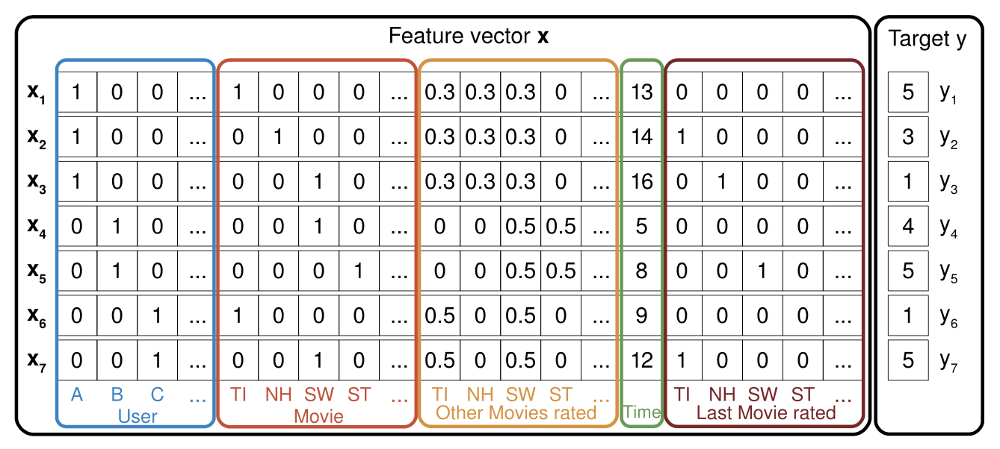
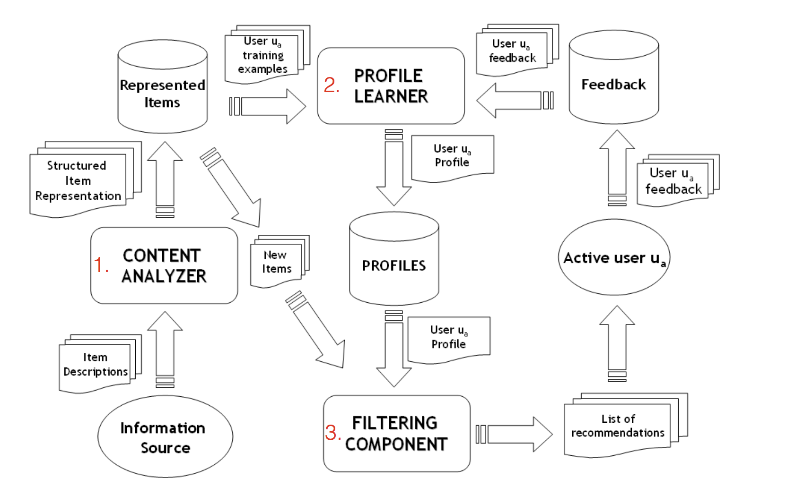
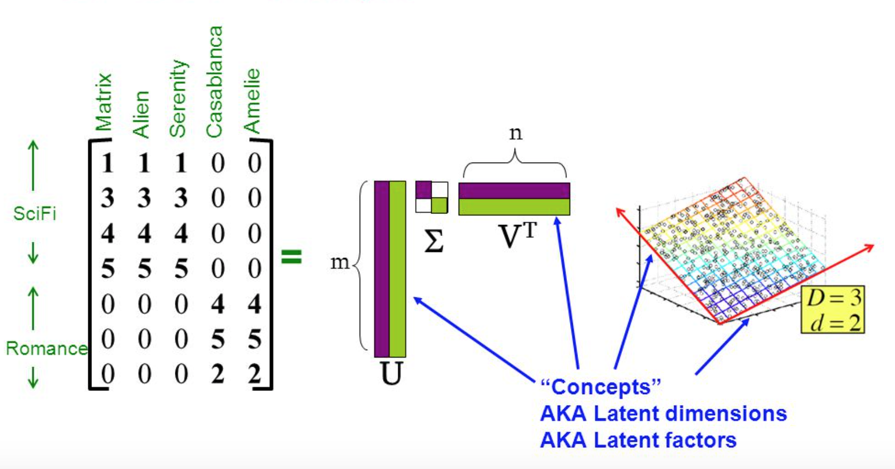

<style type="text/css">
body {
text-align: justify;
font-size: 12pt;
max-width: 1200px;
margin-left: 100px;
margin-right: 100px;
}
body .main-container {
max-width: 1200px;
font-size: 12pt;
}
</style>

```{r echo=TRUE, message=FALSE, warning=FALSE}
library(knitr)
load('FM/FM.RData')
source('Requirements.R')
source('SVD/packages.R')
read_chunk('FM/factorization_machines.R')
read_chunk('SVD/fsvd.R')
read_chunk('Evaluation/Evaluation.R')
read_chunk('content_based/libraries.R')
read_chunk('content_based/read_filter.R')
read_chunk('content_based/feature_generation.R')
read_chunk('content_based/collaborative_filter.R')
read_chunk('content_based/knn.R')
options(tibble.print_max = 5, tibble.print_min = 5)
```

## Introduction and Objectives
Not many years ago, it was inconceivable that the same person would listen to the Beatles, Vivaldi, and Lady Gaga on their morning commute. But, the glory days of Radio DJs have passed, and musical gatekeepers have been replaced with personalizing algorithms and unlimited streaming services.   

While the public’s now listening to all kinds of music, algorithms still struggle in key areas. Without enough historical data, how would an algorithm know if listeners will like a new song or a new artist? And, how would it know what songs to recommend brand new users?   

In this project, we aim to predict the chances of a user listening to a song repetitively after the first observable listening event within a time window was triggered. If there are recurring listening event(s) triggered within a month after the user’s very first observable listening event, its target is marked 1, and 0 otherwise.   
Our dataset come from a Kaggle competition, where KKBOX provides a training data set consisting of information of the first observable listening event for each unique user-song pair within a specific time duration. Metadata of each unique user and song pair is also provided.   

The train and the test data are selected from users listening history in a given time period. The train and test sets are split based on time, and the split of public/private are based on unique user/song pairs.   

## Music Recommendation Rationale
Automatic music recommendation has become an increasingly relevant problem in recent years, since a lot of music is now sold and consumed digitally. In recent years, the music industry has shifted more and more towards digital distribution through
online music stores and streaming services such as iTunes, Spotify, Grooveshark and Google Play.

## Dataset and Exploration

```{r,eval=FALSE}
<<packages_and_libraries>>
```

The original dataset contains 7,377,418 observations, where each observation corresponds to the first observable listening event for each unique user-song pair. In order to train our models, we filter the data by choosing songs with at least 1000 occurrences and users with at least 500 occurrences. We then train on 75% of the filtered dataset and test on the other 25%. This results in a training set of 869,783 observations and a testing set of 289,928 observations.

```{r,eval=FALSE}
<<reading_filtering_data>>
```

```{r, echo = FALSE}
load('EDA_data.RData')
```

### Training Data
Let's start by examining how each variable in the training_data affects the target. We base our exploratory data analysis off of the following kernel: https://www.kaggle.com/adiamaan/eda-and-feature-engineering
```{r show train, message=FALSE, result='asis', warning=FALSE, echo=FALSE}
training_data
```

Defining useful functions: 
```{r train - useful functions}
## ggplot setting for readable labels
readable_labs <- theme(axis.text=element_text(size=12),
                     axis.title=element_text(size=14),
                     plot.title = element_text(hjust = 0.5))

# Function to dislpay count of each category of the column and plot how it affects target
target_vs_column <-function(df, col_name, x , y, title){
    temp_df <- df %>% 
            group_by_(col_name) %>% 
            summarize(count = n(), mean_target = mean(target)) %>% 
            arrange(desc(mean_target)) 
    
    df_plot <- temp_df %>%  
              ggplot(aes_string(col_name, "mean_target")) + 
              geom_col(aes(fill=count)) +
              scale_fill_gradient(low='turquoise', high = 'violet')+
              coord_flip() +
              labs(x = x,
                   y = y,
                   title= title) +
              readable_labs
    print(df_plot)
    return (temp_df)
}

# Function to group songs and user by count and check it agains mean_target
target_vs_colcount <- function(df, col_name, x, y, title){
    df %>% 
      group_by_(col_name) %>% 
      summarize(count = n(), mean_target = mean(target)) %>% 
      group_by(count) %>% 
      summarize(new_count = n(), avg_target = mean(mean_target)) %>% 
      rename(no_of_items = new_count, occurence = count) %>% 
      arrange(desc(avg_target)) %>% 
      ggplot(aes(occurence, avg_target)) +
        geom_line(color='turquoise') +
        geom_smooth(color='turquoise') +
        labs(x = x,
             y = y,
             title= title) +
        readable_labs
}
```

#### Song count and User count vs target {.tabset}

##### Song count vs Target

Songs are grouped together and their count is checked against the target variable. The plot below shows the relationship between discoverability and mean target value. It is clear from the plot that the more a song occurs, the more it is discoverable by the user.

```{r song count, message=FALSE, warning=FALSE}
target_vs_colcount(training_data, "song_id", "Song Occurence", "Target", "Song Occurence vs Target")
```

##### User count vs Target

There is also a trend between how frequent of a listener the user is and the likelihood that the will listen to a song repetitively.

```{r user count, message=FALSE, warning=FALSE}
target_vs_colcount(training_data, "msno", "User Occurence", "Target", "User Occurence vs Target")
```


#### Target is unbalanced

Finally, we note that the target variable in our filtered dataset is not balanced. About 63% of the observations in the training data have a target value of one.  

```{r}
training_data %>% 
  group_by(target) %>% 
  count
```


### Members

Let's move on to the Members metadata

```{r display members, echo=FALSE}
members
```

In the members dataframe, city, bd, gender, registered via are categorical vairables and registration init and expiration date are dates. We choose not to use registered via or the date features in our models, so we will not explore these variables here.

Again we define some useful functions for exploration to help us determine how each of these variables affects the target:

```{r members function}
members_colgroup <- function(df,col_name, x, y, title, xmin, xmax, ymin, ymax){
                      
    temp_df <- df %>% 
                  group_by_(col_name) %>% 
                  count() %>% 
                  arrange(desc(n))
    
    df_plot <- temp_df %>% 
                    ggplot(aes_string(col_name, "n")) + 
                    geom_col(fill='goldenrod2') + 
                    labs(x = x,
                         y = y,
                         title = title) +
                    xlim(xmin, xmax) +
                    ylim(ymin, ymax) +
                    readable_labs
    
    print(df_plot)
    return(temp_df)

}
```

#### Distribution of city, bd(age), gender {.tabset}

##### Age

There seem to be some outliers in the age field, so we will have to clean these before we build our models.  
Sorted bd (age) vs Frequency is shown in the tibble as well as the graph. There are 1578 records with 0 as age. This could be either outliers or missing values. We plot in the age range 1-100 to show the real distribution.  

```{r age tab, warning=TRUE}
members_colgroup(members, "bd", "Age", "Frequency", "Age Distribution", 1, 100, 0, 200)
```

##### City

```{r city tab, warning=TRUE}
members_colgroup(members, "city", "City", "Frequency", "City Distribution", 0, 25, 0, 1500)
```


##### Gender

Male and female are almost equal. We have a lot of missing values, as well.
```{r gender tab, warning=TRUE}
members %>% 
  group_by(gender) %>% 
  count
```

### Songs

Finally, let's examine the available song metadata. These features will be useful for both our content-based recommender and factorization machine model.

```{r songs display}
songs
```

#### Top Items{.tabset}

Let's see top 100 frequent items in each category,

```{r top 100 function}
top_100 <- function(df, col_name)
{
  temp_df <- df %>% 
    group_by_(col_name) %>% 
    count %>% 
    arrange(desc(n)) %>% 
    print
  
  return(temp_df)
}
```


##### Top 100 Artists

```{r top 100 artist}
artist_count <- top_100(songs, "artist_name")
```

##### Top 100 Lyricist

```{r top 100 lyricist}
lyricist_count <- top_100(songs, "lyricist")
```

##### Top 100 composer

```{r top 100 composer}
composer_count <- top_100(songs, "composer")
```

##### Top 100 Language

```{r top 100 language}
language_count <- top_100(songs, "language")
```


`r sum(songs$artist_name == songs$lyricist)` songs have same artist and lyricist name.  
`r sum(songs$lyricist == songs$composer)` songs have same lyricist and composer name.     
`r sum(songs$artist_name == songs$composer)` songs have same artist and composer name.   
`r sum(songs$artist_name == songs$lyricist)`songs have same artist and lyricist name.  


##### Top Genre's
  
Genre id is a multi label column with a minumum label of 1 to a maximum label of 8.  
There are 192 unique genres. There are some missing values as well.

```{r top genres, message=FALSE, warning=FALSE}
genre_count <- songs %>% 
                  separate(genre_ids, c("one", "two", "three", "four", "five", "six", 
                                        "seven", "eight"), extra="merge") %>% 
                  select(one:eight)%>% 
                  gather(one:eight, key="nth_id", value="genre_ids", na.rm=TRUE) %>% 
                  group_by(genre_ids) %>% 
                  count %>% 
                  arrange(desc(n)) %>% 
                  print()
```

#### Distribution of song length

```{r song length dist, message=FALSE, warning=FALSE}
songs %>% 
  mutate(song_length = song_length/6e4) %>% 
  ggplot(aes(song_length)) +
  geom_histogram(binwidth = 0.25, fill='darkorchid3') +
  labs(x='Song Length', y = 'Frequency', title = 'Distribution of song length') +
  xlim(0, 10)
```

## Collaborative Filter
We build item based and user based collaborative filter model by using the recommenderlab package to take it as a baseline for the future models. Important parameters for the model are:   
* Similarity Measure: Jaccard, as the ratings are binary
* Number of neighbors: 30

```{r, eval=TRUE, echo=FALSE}
load('content_based/content_cf.RData')
```
### Item Based CF
```{r, eval=FALSE}
<<item_based_collaborative_filter>>
```

### User Based CF
```{r, eval=FALSE}
<<user_based_collaborative_filter>>
```

### Baseline Accuracy Measures
```{r, eval=FALSE}
<<item_based_collaborative_filter_accuracy>>
<<user_based_collaborative_filter_accuracy>>
<<random_accuracy>>
```
```{r, eval=TRUE}
<<cf_conf_matrices>>
<<cf_accuracy_plots>>
```

* We can see that item-based and user-based collaborative filters are better performing than recommending every song to the user.

## Factorization Machines
### Model Summary:

We first explore factorization machines. At their core, factorization machines allow us to model feature-rich datasets by including higher order interactions weighted by the inner product of latent vectors. As a result, we can estimate reliable parameters even in highly sparse data! Factorization machines consist of the following parameters that must be learned (where n is the number of features in the dataset and k is the dimenstionality of the latent features):
  
* $w_0$ – the global bias term  
* $\mathbf{w}$ – a vector of weights for each of the n input variables  
* $V$ – an $n \times k$ matrix, where the inner product of the $i^{th}$ and $j^{th}$ row of $V$ is the weight of the interaction between the $i^{th}$ and $j^{th}$ input variable.

The model is written as:
$$\hat{y}(\mathbf{x}) := w_0 + \sum_{j=1}^pw_jx_j + \sum_{j=1}^p \sum_{j'=j+1}^p x_jx_{j'} \sum_{f=1}^kv_{j,f}v_{j'\,f}$$



The image above (from Rendle [2010]) shows the format the data must be in to train a factorization machine model. Each feature vector $\mathbf{x}$ is used to predict each target value *$y$*. In our dataset, we one hot encode songs (song_id) and members (msno). Additionally, we include the following features from the metadata to improve accuracy of predictions:  

Song metadata:
  
* Language  
* Artist name  
* Genre (first listed if multiple)  
* Number of genres  
* Song length  

Member metadata:  
  
* City  
* Gender  
* Birthday (age)    

Additional features:  
  
* Source system tab  
* Source screen name  
* Source type  

We begin by merging the training dataset with the song and member metadata and doing some data cleaning and feature engineering:

```{r, eval=FALSE}
<<FM_merge_clean>>
```

The dataset is large, so for the sake of efficiency, we use the R library libFMexe which is an interface to the C++  libFM library by Steffen Rendle. This allows us to run many models and tune k, the hyperparameter for the number of latent dimensions. 

While we explored factorization machines with several different learning methods (e.g. ALS and SGD), the model we present here is a second order factorization machine using Markov chain Monte Carlo. Stochastic gradient descent and alternating least squares require additional parameter tuning to determine the optimal learning rate (SGD) and regularization terms (SGD and ALS), which is simply not feasible given the size of the data set and our compute resources. Furthermore, from preliminary models, MCMC appeared to outperform both SGD and ALS, so the choice of MCMC as the learning method for the model is obvious to maximize prediction accuracy.

### Tuning Hyperparameters

#### Choosing k:

We use 3-fold cross validation with 100 iterations of MCMC to determine the optimal number of latent dimensions k. For each fold, the model outputs a vector of probabilities equal to the size of the held out data. This vector is converted to a vector of binary values based on a probability threshold of 0.5. The accuracy is then taken to be the number of target values that the model correctly predicted divided by the total number of target values in the held out data. The error rate is (1 – accuracy). 

```{r, eval=FALSE}
<<cv_k>>
```

We analyze the results of the cross validation parameter tuning by plotting the mean error rate across the folds as a function of k. We choose k with the lowest average error rate across the three folds, or equivalently the highest average accuracy. We note that while the error rate for the model to compa re models. The following plot displays the error rate as a function of k, the number of latent dimensions. We also display a table of the mean error rate across the three folds (with standard error) for each k.

```{r}
<<tune_cv>>
<<fm_k_cv_results>>
```

#### Choosing initialization standard deviation
Next, we use cross-validation to determine the optimal standard deviation initialization. This parameter corresponds to the standard deviation of the normal distribution that is used for initializing the parameters $V$. It is important that we choose a good value for this parameter so that the error rate converges quickly. Again, we use 3-fold cross validation with 100 iterations of MCMC to tune this parameter.

```{r, eval=FALSE}
<<cv_sd>>
```

```{r}
<<fm_sd_cv_results>>
```

The optimal standard deviation is clearly .1.

### FM Model
From the parameter tuning above, we determine that k = 25 latent dimensions gives us the highest accuracy. Additionally, an initialized standard deviation of 0.1 leads to the quickest error rate convergence. Thus, we will set the hyperparamters to these values for our final model. We will train our final factorization machine model using 500 iterations of MCMC to ensure convergence in error rate. We then use this model to generate predictions for the testing dataset. 

```{r, eval = FALSE}
<<fm_model>>
```

We look at the training and testing error as a function of the number of iterations of MCMC to ensure the error rate converges in 500 iterations.

```{r}
<<err_convergence>>
```

The decrease in error rate is very small after approximately 300 iterations, for we conclude that 500 iterations is sufficient to train the model.

### Evaluation
Finally, we evaluate the model according to the following metrics:  

* accuracy  
* error   
* precision  
* recall  
* F1  
* auc
  
Additionally, we display the confusion matrix and an ROC curve for the predictions.

We start by writing a generic evaluation function, which we will use to compare the performance of different models:

```{r}
<<evaluate_function>>
```

We then call this function on the output probabilities of the FM model:
```{r,eval=FALSE}
<<evaluate_FM>>
```

Finally, we display the evaluation metrics and the ROC plot.
```{r}
<<evaluate_FM_print>>
```

We find that the accuracy of approximately 0.7482 is well above that of user-based collarborative filtering (0.67), item-based collaborative filtering (0.71), and the random baseline model (0.63). Additionally, the recall for this model is quite good. Out of all of the observations in the testing dataset with target value 1, our model was able to retrieve 84.3% of them. This also indicates that the coverage of our model is quite good, since we are not only predicting a target value of 1 for the most popular songs and most active users. Still, our prediction accuracy might
be affected by the popularity of the song and how active the user is. We explore these relationships in the following plots:

## Content Based Recommender
In this section, we build the content based recommendation from scratch without using any ready to build package.   

* Content-based systems are designed to exploit scenarios in which items can be described with descriptive sets of attributes.
* This approach is particularly useful when the item is new, and there are few ratings available for that item.
* Unlike collaborative systems, which explicitly leverage the ratings of other users in addition to that of the target user, content-based systems largely focus on the target user’s own ratings and the attributes of the items liked by the user. Therefore, the other users have little, if any, role to play in content-based systems.
* Content-based systems are largely used in scenarios in which a significant amount of attribute information is available at hand. In this case, we have structured data in the form of song length, genres, artists, composer, lyricist and language.   
* The general architecture of a content based recommender can be visualized through the following diagram.


We do the following step to build our content based recommender by utilising these song features.

### Preprocessing and Feature Extraction
* In the feature extraction phase, the descriptions of various items are extracted. Although it is possible to use any kind of representation, such as a multidimensional data representation, the most common approach.
* We generate one hot encoded vectors for the items to be represented in the feature space.

```{r,eval=FALSE}
<<content_feature_generation>>
```
```{r,eval=TRUE, echo=TRUE}
<<big_flat_item_features_sample>>
```

We now have our items represented as feature vectors 

### knn Classification Model
* The nearest neighbor classifier is one of the simplest classification techniques, and it can be implemented in a relatively straightforward way.
* We construct model for each user based on his/her ratings for the items. Content based recommender system can be thought of as a classification problem for each user.

```{r,eval=FALSE}
<<content_knn_prediction>>
```

### Evaluation
* We compare the content based model with the collaborative filter models and see that it is better than random prediction and outperforms user-based collaborative filtering, however, the number of neighbors in the knn model were restricted to 32, thus under performing item-based collaborative filter.

```{r,eval=TRUE}
<<content_knn_evaluation_nearest_neighbors_plot>>
```

## SVD
```{r, echo = FALSE}
#testing_data <- readRDS("SVD/data/testing_data.rds")
fsvd_models <- readRDS("SVD/FSVD_info/fsvd_models.rds")
fsvd_models_results1 <- readRDS("SVD/FSVD_info/fsvd_models_results1.rds")
fsvd_models_results2 <- readRDS("SVD/FSVD_info/fsvd_models_results2.rds")
fsvd_models_results3 <- readRDS("SVD/FSVD_info/fsvd_models_results3.rds")
fsvd_models_results <- list(fsvd_models_results1[[1]], fsvd_models_results1[[2]], fsvd_models_results2[[1]], fsvd_models_results2[[2]], fsvd_models_results3)
fsvd_test_results<- readRDS("SVD/FSVD_info/fsvd_test_results.rds")
evaluation_result <- readRDS("SVD/FSVD_info/evaluation_result.rds")
```
### Model Summary:

We also explore Singular Value Decompositions to build our model. The SVD algorithm is a matrix factorization techinque to reduce the number of features in a dataset. For a large $M \times N$ user-item ratings matrix A of rank $r$, SVD model maps both users and items to a joint latent factor space of $k$ singular values by decomposing the ratings matrix and reducing its space dimensions from $r$ to $k$. The latent factor space tries to explain ratings by characterzing both items and users on factors automatically inferred from user feedback.

The core formula for SVD matrix decomposition is:

$A = U \Sigma V^T$ 

where $\Sigma$ is the diagonal matrix of rank $k$ that contains the laten factors, $U$ and $V$ each represents the number of users and items.

Here's an example of SVD dimensionality reduction with user movie ratings. To apply to our dataset, simply switch out movie genres with song categories. 


The rule for predicting ratings $r_{ui}$ for each user-item pair with SVD is :

$\hat{r}_{ui} = \mu + b_i + b_u + q_i^T p_u$

where each item $i$ is represented by vector $q_i$ and each user $u$ is associated with vector $p_u$, $\mu$ is the average rating, $b_u$ and $b_i$ are user bias and item bias. 

Our objective function for optimizing model paramters minimizes the regularized squared error:

$\min_{b_u, b_i,q_i,p_u} \Sigma (r_ui -\mu - b_i - b_u - q_i^T p_u)^2 + \lambda (b_i^2 +b_u^2 +\|q_i\|^2 + \|p_u\|^2)$

### Implementation using stochastics gradient descent (Funk SVD):

The popular implementation method which we are use is optimizing the stochastic gradient descent. The method is first introduced by Simon Funk, hence the name Funk SVD. Since Funk SVD allows missing values in ratings matrix, it is suitable for our data set as the our matrix is quite sparese. Improved upon simple matrix decomposition, it allows us to include regularization term $\lambda(b_i^2 +b_u^2 +\|q_i\|^2 + \|p_u\|^2)$ and control its by $\lambda$. For each given rating $r_ui$ in the training data, we make prediction $\hat{r}_{ui}$ with reduced latent factors and calculate the prediction error $e_ui = r_ui - \hat{r}_{ui}$. We update the parameters based on the prediction error as follows:

* $b_u \leftarrow b_u + \gamma  (e_{ui} - \lambda  b_u)$

* $b_i \leftarrow b_u + \gamma  (e_{ui} - \lambda  b_i)$

* $q_i \leftarrow q_i + \gamma  (e_{ui}  p_u - \lambda  q_i)$

* $q_i \leftarrow q_i + \gamma  (e_{ui}  p_u - \lambda  q_i)$

where $\gamma$ is learning rates, and $\lambda$ is regularization.

### Our Model
First, we convert our data into a $M \times N$ ratings matrix with all users and songs so that each element $r_{ui}$ represents whether user $u$ will listen to song $i$ again. For missing user-song pair, we replace it with NA. We also replace the known values in the orognal test data with NA so we can make our own predictions. Later on, we will be comparing model predictions with actual values in model evaluation. 

Then we split the matrix into training and testing with a train proportion of 0.8.
```{r}
<<train_test_matrix>>
```

Then, we start training our models with the train matrix. For choosing the optimal paramter later, we use 5 different k values.
```{r, eval=FALSE}
<<fsvd_models>>
```

For each model, our prediction function outputs training error(RMSE), probability predictions, and binarized prediciton based on a threshold of 0.5 probability.
```{r,eval=FALSE}
<<train_predict>>
<<fsvd_models_Predict>>
```

### Tuning Parameter
#### Latent factor K

We test the SVD model with different number of latent factors $(k=5,8,10,20,40)$ and compared their training RMSE to choose the optimal one. Intuitively, more latent factors will output more accurate results, but we also take into account the training and prediction time, which varies significantly with different k values. 

```{r}
<<fsvd_results>>
```
From RSME and prediction accuracy, we can see that larger value of k will not improve the model significantly. Therefore, we choose the optimal value of k to be 10. 

### Prediction Results
Sample output:
```{r}
<<fsvd_sample_output>>
```

### Evaluation
Accuray for testing data and evaluation results
```{r}
#Prediction Accuracy
<<fsvd_prediction_error>>
evaluation_result
```

The final accuary for SVD approximation with k = 10 is 0.71.

## Hybridization
### Results
## Conclusion
## References
